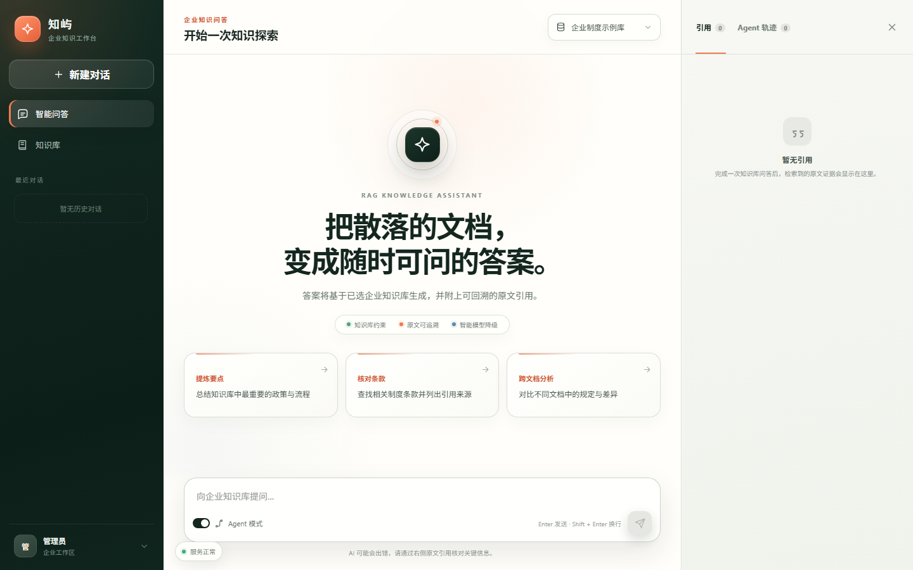
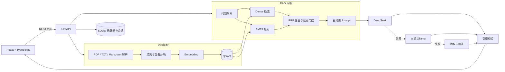

# 企业文档智能问答系统

> 一个可本地运行、答案可追溯、模型可降级的企业级 RAG（Retrieval-Augmented Generation）应用。

系统支持创建隔离知识库、上传企业文档、混合检索原文证据，并生成带页码引用的回答。默认使用嵌入式 Qdrant 和本地 hashing embedding，无需 Docker 或模型密钥即可跑通完整链路；配置后可按 **DeepSeek → Ollama → 抽取式回答** 自动降级。

`Python 3.11+` · `FastAPI` · `React 19` · `TypeScript` · `Qdrant` · `SQLite` · `PyMuPDF` · `Ollama`

## 项目亮点

- **有依据的回答**：Dense 向量检索与 BM25 关键词检索并行召回，通过加权 RRF 融合排序；答案附带文档名、页码、片段和检索分数。
- **三级模型容错**：DeepSeek 主模型异常、超时或返回无效内容时自动切换本机 Ollama；二者都不可用时，仍能返回带引用的抽取式答案。
- **引用闭环校验**：生成后检查 `[S1]` 等引用是否合法；模型未给出有效引用时自动降级，避免“答案看似合理但无法核验”。
- **受控 Agent 工作流**：完成意图路由、问题规划、混合检索、证据门控、受约束生成和引用校验，仅开放明确的知识库工具。
- **本地优先、可平滑扩展**：开箱使用本地 SQLite、嵌入式 Qdrant 和确定性 embedding；也可切换远程 Qdrant、OpenAI-compatible Embedding 与 LLM。
- **完整产品界面**：包含知识库与文档管理、批量上传、对话历史、会话删除、引用检查器、Agent 执行轨迹及桌面/移动端响应式布局。
- **面向真实文件场景**：限制文件类型与体积、校验 PDF 文件头、计算 SHA-256 去重，并对中断摄取和失败重试做状态处理。

## 界面预览



> 截图使用独立的演示数据库生成，不包含真实对话、上传文件、个人信息或 API Key。

## 系统架构



### RAG 请求链路

1. 文档解析：管理界面支持 PDF；上传 API 同时支持 PDF、TXT 与 Markdown。
2. 文本预处理：按页抽取与清洗文本，移除重复页眉页脚，并按配置执行重叠分块。
3. 向量入库：批量生成 embedding，将正文及文档、页码、分块序号等元数据写入 Qdrant。
4. 混合召回：对问题执行 Dense 与 BM25 检索，以 `0.65 / 0.35` 权重进行 RRF 融合排序。
5. 证据门控：过滤空片段和低相关证据，在上下文上限内构建编号证据区。
6. 受约束生成：系统 Prompt 要求仅依据证据回答，并忽略文档中试图覆盖系统规则的指令。
7. 自动降级：依次尝试 DeepSeek、Ollama 和抽取式回答，保留知识库在模型故障时的可用性。
8. 引用校验：检查回答中的引用编号，并向前端返回原文片段、页码与执行轨迹供用户核验。

## 功能清单

| 模块 | 能力 |
| --- | --- |
| 知识库 | 创建和删除隔离知识库，记录对应 embedding、维度与分块配置 |
| 文档 | 批量上传、SHA-256 去重、摄取状态、失败重试、下载与删除 |
| 检索 | Dense + BM25 + RRF 混合检索，可单独调用搜索 API |
| 问答 | 多知识库选择、上下文会话、普通/Agent 模式、模型来源展示 |
| 可解释性 | 原文引用、页码、相关度、Dense/BM25 分数、Agent 步骤与耗时 |
| 会话 | 最近对话、历史恢复、移动端历史面板和二次确认删除 |
| 运维 | 健康检查、公开运行配置、FastAPI OpenAPI 文档和本地/远程 Qdrant |
| 安全基线 | 可选 API Key、上传限制、文件签名校验、安全响应头和错误脱敏 |

## 技术栈

| 层次 | 技术 |
| --- | --- |
| 前端 | React 19、TypeScript 5、Vite 7、原生 CSS |
| API | FastAPI、Pydantic 2、Uvicorn、HTTPX |
| 文档处理 | PyMuPDF，原生 TXT / Markdown 解析 |
| 检索 | Qdrant、Dense Retrieval、BM25、Weighted RRF |
| 数据 | SQLite 元数据与会话、Qdrant 向量及 payload |
| 模型 | DeepSeek / 任意 OpenAI-compatible LLM、Ollama、抽取式 fallback |
| 工程化 | pytest、pytest-asyncio、GitHub Actions、PowerShell 启动脚本、Docker Compose（可选 Qdrant） |

## 快速启动

### 环境要求

- Windows PowerShell 7（推荐的一键启动方式）
- Python 3.11+，推荐 Python 3.12
- Node.js 20+
- Ollama（仅在启用本地生成式备用模型时需要）
- Docker Desktop（仅在使用独立 Qdrant 时需要）

### 一键启动（Windows）

在项目根目录执行：

```powershell
Copy-Item .env.example .env
.\start.ps1 -Install
```

首次执行会创建 `.venv` 并安装前后端依赖。以后直接运行：

```powershell
.\start.ps1
```

开发后端时可启用自动重载：

```powershell
.\start.ps1 -Reload
```

启动后访问：

- 前端开发服务器：<http://127.0.0.1:5173>
- FastAPI 文档：<http://127.0.0.1:8000/docs>
- 健康检查：<http://127.0.0.1:8000/api/health>

按 `Ctrl+C` 会同时停止前后端进程。

### 手动启动

后端：

```powershell
python -m venv .venv
.\.venv\Scripts\python.exe -m pip install -r .\backend\requirements.txt
Set-Location .\backend
..\.venv\Scripts\python.exe -m uvicorn app.main:app --reload --port 8000
```

另开一个终端启动前端：

```powershell
Set-Location .\frontend
npm ci
npm run dev
```

Vite 会把 `/api` 代理到 `http://127.0.0.1:8000`。

如需由 FastAPI 同端口提供生产构建，先执行 `npm run build`，再单独启动后端；后端检测到 `frontend/dist` 后会挂载静态页面。

## 模型与环境变量

复制 `.env.example` 为 `.env` 后修改。下面只展示**占位值**，不要把真实密钥写入 README、Issue、日志或提交记录。

### DeepSeek 主模型 + Ollama 自动备用

```dotenv
# 主模型：DeepSeek（OpenAI-compatible Chat Completions）
LLM_PROVIDER=auto
LLM_API_KEY=replace-with-your-deepseek-api-key
LLM_BASE_URL=https://api.deepseek.com
LLM_MODEL=deepseek-flash
LLM_TEMPERATURE=0.1
LLM_TIMEOUT_SECONDS=90

# 二级备用：本机 Ollama
LLM_FALLBACK_ENABLED=true
LLM_FALLBACK_API_KEY=
LLM_FALLBACK_BASE_URL=http://127.0.0.1:11434/v1
LLM_FALLBACK_MODEL=qwen3:4b-instruct
LLM_FALLBACK_TIMEOUT_SECONDS=180
```

准备 Ollama 模型：

```powershell
ollama pull qwen3:4b-instruct
ollama list
```

当主模型连接失败、超时、返回 HTTP 错误或无效内容时，系统会切换 Ollama。若两个生成模型都不可用，则返回最相关的原文摘录及引用。修改 `.env` 后需要重启后端。

示例沿用当前项目的模型名；若服务返回 `model not found`，请以对应 DeepSeek 账号实际可用的模型名称为准。

### 零密钥本地模式

```dotenv
QDRANT_MODE=local
QDRANT_PATH=./data/qdrant

EMBEDDING_PROVIDER=local
EMBEDDING_MODEL=hashing-multilingual-v1
EMBEDDING_DIMENSION=768

LLM_API_KEY=
LLM_BASE_URL=
LLM_MODEL=
LLM_FALLBACK_ENABLED=false
```

该模式无需 Docker、API Key 或模型下载，适合演示摄取、检索、引用与离线降级链路。本地 hashing embedding 主要用于开发和流程验证；生产检索建议接入 BGE 或 OpenAI-compatible 语义 embedding。

### OpenAI-compatible Embedding

```dotenv
EMBEDDING_PROVIDER=openai
EMBEDDING_API_KEY=replace-with-your-embedding-key
EMBEDDING_BASE_URL=https://your-provider.example.com/v1
EMBEDDING_MODEL=your-embedding-model
EMBEDDING_DIMENSION=1024
```

`EMBEDDING_DIMENSION` 必须与服务实际返回的维度一致。切换 embedding 模型或维度后，应新建 collection 并重新上传文档，不能混用历史向量。

### 独立 Qdrant（可选）

```powershell
docker compose up -d qdrant
```

```dotenv
QDRANT_MODE=remote
QDRANT_URL=http://127.0.0.1:6333
QDRANT_API_KEY=
```

Qdrant 控制台默认位于 <http://127.0.0.1:6333/dashboard>。

### 可选 API 鉴权

后端设置 `RAG_API_KEY` 后，除健康检查和公开配置外的 `/api` 请求都需携带 `X-API-Key` 或 Bearer Token。前端开发环境可通过 `VITE_RAG_API_KEY` 发送请求。

> `VITE_*` 会进入浏览器产物，不能被视为生产密钥。公网部署应在反向代理或后端接入登录态、OIDC/SSO 与权限校验，不要把共享管理密钥编译进前端。

## API 概览

完整接口及可执行 Schema 以 `/docs` 为准。

| 方法 | 路径 | 用途 |
| --- | --- | --- |
| `GET` | `/api/health` | 检查 API、向量数据库和当前模型状态 |
| `GET` | `/api/settings/public` | 获取不含密钥的公开运行配置 |
| `GET / POST` | `/api/knowledge-bases` | 查询或创建知识库 |
| `DELETE` | `/api/knowledge-bases/{id}` | 删除知识库、文档元数据与向量集合 |
| `GET` | `/api/documents` | 查询文档，可按知识库过滤 |
| `POST` | `/api/documents/upload` | 批量上传并同步索引文档 |
| `GET` | `/api/documents/{id}/file` | 下载已上传的原文件 |
| `DELETE` | `/api/documents/{id}` | 删除文档、原文件及对应向量 |
| `POST` | `/api/search` | 只执行混合检索，不调用 LLM |
| `POST` | `/api/chat` | 执行 RAG / Agent 问答 |
| `GET` | `/api/chat/sessions` | 获取最近会话 |
| `GET` | `/api/chat/sessions/{id}` | 获取会话消息、引用与轨迹 |
| `DELETE` | `/api/chat/sessions/{id}` | 删除会话及其全部消息 |

## 测试与质量检查

后端测试覆盖文档解析与分块、embedding、混合检索、向量存储、Agent、LLM 降级、注册表和 API。当前基线为 **59 个后端测试通过**。

```powershell
# 在项目根目录执行后端测试
.\.venv\Scripts\python.exe -m pytest .\backend\tests

# 类型检查并构建前端
Set-Location .\frontend
npm run build
```

`npm run build` 会先对应用与 Vite 配置执行 TypeScript `--noEmit` 检查，再生成生产构建。

仓库内的 GitHub Actions 会在推送到 `main` 或创建 Pull Request 时，使用 Python 3.12 运行后端测试，并使用 Node.js 20 执行 `npm ci` 与前端构建。

## 目录结构

```text
.
├─ backend/
│  ├─ app/
│  │  ├─ main.py              # FastAPI、生命周期、中间件和路由
│  │  ├─ db.py                # SQLite 元数据与会话持久化
│  │  ├─ schemas.py           # Pydantic 请求/响应模型
│  │  └─ services/            # 摄取、检索、向量库、Agent、LLM 和 Prompt
│  └─ tests/                  # 后端自动化测试
├─ frontend/
│  └─ src/                    # React 页面、API 客户端、类型和样式
├─ docs/
│  ├─ assets/dashboard.png    # 脱敏演示截图
│  └─ RESUME.md               # 简历写法与面试讲解素材
├─ .github/workflows/ci.yml    # 后端测试与前端构建流水线
├─ data/                       # 运行时文档、SQLite 和向量数据（Git 忽略）
├─ .env.example               # 无密钥环境变量模板
├─ docker-compose.yml         # 可选的独立 Qdrant
└─ start.ps1                  # Windows 一键安装与启动
```

## 安全与公开仓库说明

- `.env`、私钥、上传文档、SQLite、Qdrant 数据和构建产物均应保持在 Git 忽略范围内。
- 发布前应执行历史扫描；如果密钥曾进入提交历史，仅删除文件不够，必须立即撤销并轮换密钥。
- 文档内容始终作为不可信数据处理；Prompt 明确要求忽略证据区中的操作指令，Agent 工具采用白名单。
- 当前实现适合作品集、内部原型和单机部署。公网生产环境还需补充用户身份、租户隔离、文档 ACL、审计日志、限流和 CSRF 策略。
- 扫描版 PDF 需要额外 OCR；大文件摄取建议迁移到任务队列，对象文件应进入 S3/OSS 等受控存储。
- Ollama 和本地 Qdrant 默认不应直接暴露到公网；远程部署应启用 TLS、鉴权、备份和网络访问控制。

## 简历描述

可直接使用的一句话版本：

> 设计并实现企业文档 RAG 智能问答系统，基于 FastAPI、React 与 Qdrant 完成文档摄取、Dense + BM25 混合检索、可追溯引用和会话管理，并构建 DeepSeek → Ollama → 抽取式回答三级容错链路。

建议的三条项目要点：

- 构建 PDF/TXT/Markdown 文档摄取管线，实现清洗、重叠分块、批量向量化、SHA-256 去重和 Qdrant 索引，并以 SQLite 管理知识库、文档和会话状态。
- 设计 Dense + BM25 + Weighted RRF 混合检索和证据门控流程，通过 Prompt 隔离、引用合法性校验与原文回溯降低无依据生成风险。
- 封装 OpenAI-compatible 模型适配层，实现 DeepSeek 主模型失败后自动切换 Ollama，双模型不可用时保留抽取式回答；完成 59 项后端自动化测试和前端类型/构建检查。

更多按投递方向拆分的版本、面试讲解和可量化指标建议见 [docs/RESUME.md](docs/RESUME.md)。

## 后续演进

- 接入 BGE-M3 / 企业 Embedding 服务并建立离线检索评测集
- 为扫描 PDF 增加 OCR 与版面分析
- 增加 reranker、查询改写与多轮指代消解评测
- 接入 SSO、租户/文档 ACL 和审计日志
- 将摄取任务异步化，并增加可观测性、限流与部署流水线
